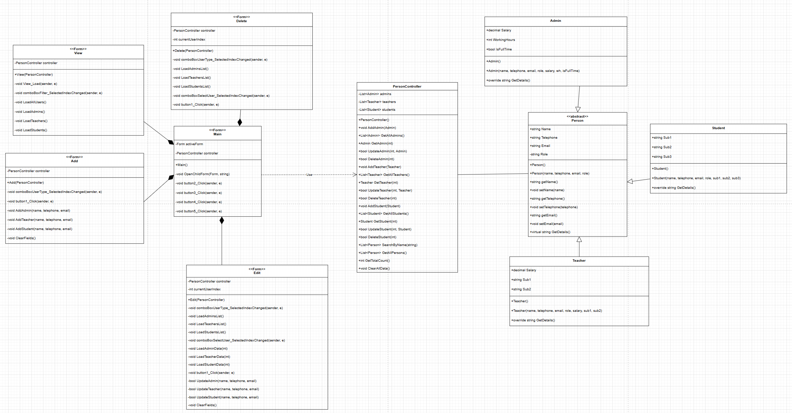
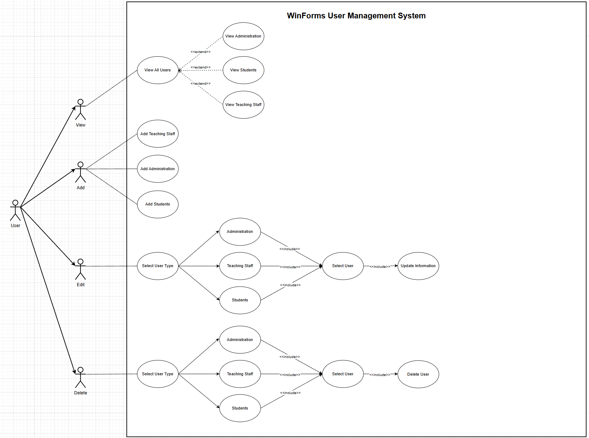
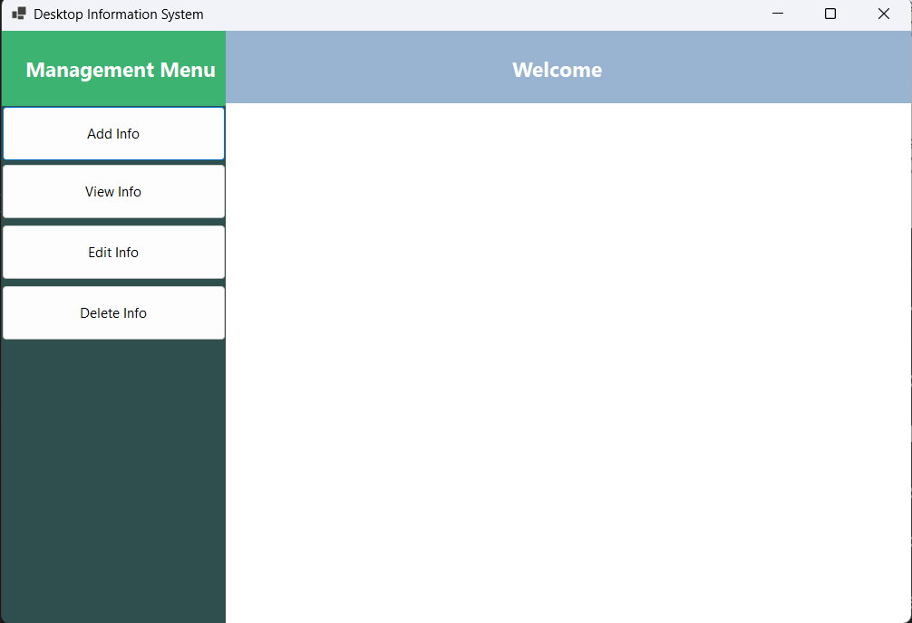
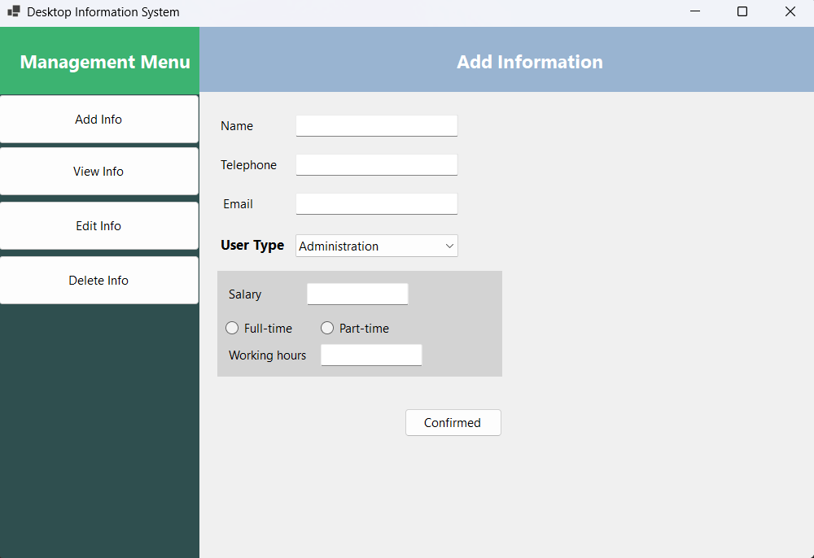
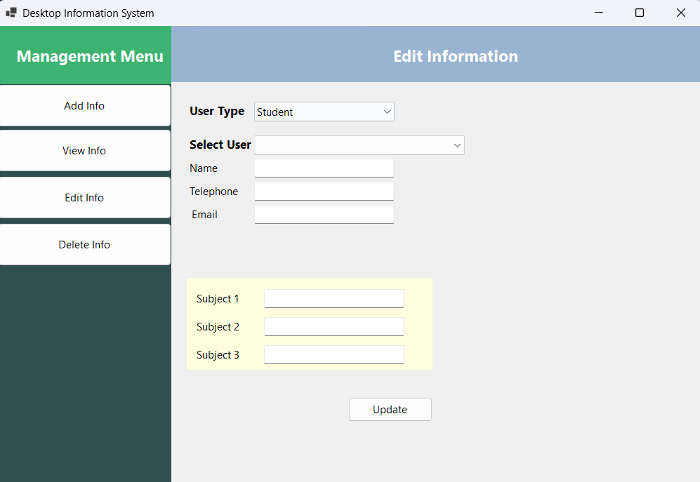
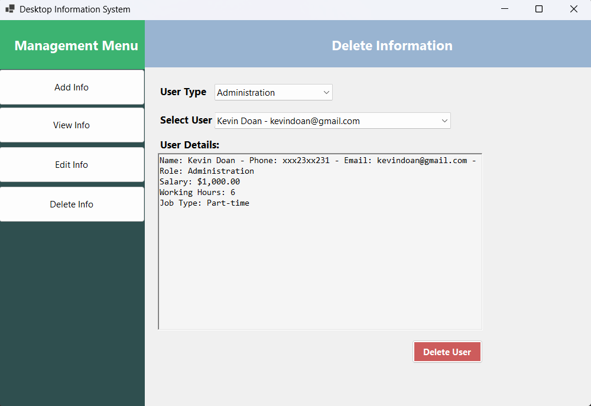

# WinForms User Management System

A comprehensive user management application built with **Windows Forms** and **.NET 10**, implementing the **MVC (Model-View-Controller)** architecture pattern.

## 📋 Table of Contents

- [Overview](#overview)
- [Features](#features)
- [Architecture](#architecture)
- [Technologies](#technologies)
- [Getting Started](#getting-started)
- [Project Structure](#project-structure)
- [Usage](#usage)
- [Class Diagram](#class-diagram)
- [Screenshots](#screenshots)
- [Contributing](#contributing)
- [License](#license)

## 🎯 Overview

This application provides a complete CRUD (Create, Read, Update, Delete) system for managing three types of users:
- **Administration Staff** - with salary, working hours, and employment type
- **Teaching Staff** - with salary and subjects taught
- **Students** - with enrolled subjects

## ✨ Features

### Core Functionality
-  **Add Users** - Create new Administration, Teaching Staff, or Student records
-  **View Users** - Display all users with role-based filtering
-  **Edit Users** - Update existing user information
-  **Delete Users** - Remove users with confirmation dialog

### Additional Features
- 🔍 **Role-based Filtering** - View users by specific roles
- 📊 **Detailed User Information** - Display comprehensive user profiles
- 🎨 **User-friendly Interface** - Intuitive navigation and form design
- ✔️ **Input Validation** - Ensure data integrity
- ⚠️ **Error Handling** - Graceful error messages and exception handling

## 🏗️ Architecture

This application follows the **MVC (Model-View-Controller)** pattern:

### Models (Data Layer)
- `Person` - Abstract base class for all user types
- `Admin` - Administration staff with salary and work details
- `Teacher` - Teaching staff with salary and subjects
- `Student` - Students with enrolled subjects

### Controllers (Business Logic Layer)
- `PersonController` - Manages all CRUD operations and business logic

### Views (Presentation Layer)
- `Main` - Main window with navigation
- `Add` - Form for adding new users
- `View` - Form for displaying users with filters
- `Edit` - Form for updating user information
- `Delete` - Form for removing users

## 🛠️ Technologies

- **Framework**: .NET 10.0
- **Language**: C# 14.0
- **UI Framework**: Windows Forms
- **Architecture**: MVC Pattern
- **IDE**: Visual Studio 2026

## 🚀 Getting Started

### Prerequisites

- [.NET 10 SDK](https://dotnet.microsoft.com/download/dotnet/10.0) or later
- Visual Studio 2022/2026 or later (recommended)
- Windows OS

### Installation

1. **Clone the repository**

2. **Open the solution**

3. **Build the project**

4. **Run the application**

## 📖 Usage

### Adding a User

1. Click **"Add Information"** button on the main window
2. Select the user type (Administration/Teaching Staff/Student)
3. Fill in the required information:
   - **Common fields**: Name, Telephone, Email
   - **Admin**: Salary, Working Hours, Employment Type
   - **Teacher**: Salary, Subject 1, Subject 2
   - **Student**: Subject 1, Subject 2, Subject 3
4. Click **"Add"** button to save

### Viewing Users

1. Click **"View All Information"** button
2. Use the filter dropdown to view:
   - All Users
   - Administration only
   - Teaching Staff only
   - Students only

### Editing a User

1. Click **"Edit Information"** button
2. Select the user type
3. Choose the user from the dropdown list
4. Modify the information as needed
5. Click **"Update"** to save changes

### Deleting a User

1. Click **"Delete Information"** button
2. Select the user type
3. Choose the user from the dropdown list
4. Review the user details
5. Click **"Delete User"** and confirm
---
## 📊 Class Diagram

## 📊 Use Case Diagram

---
## Screenshots

### Main Window

### Add User Form
 

### View Users
 

### Edit User Form
 

### Delete User Form

---

## 👤 Author

**DK0310**
- GitHub: [@DK0310](https://github.com/DK0310)
- Repository: [AppDev](https://github.com/DK0310/AppDev)

## 🙏 Acknowledgments

- Built with Windows Forms and .NET 10
- Implements MVC architecture pattern
- Inspired design by [RJ Code Advance](https://www.youtube.com/watch?v=BtOEztT1Qzk)

---

## 📄 License
This project was created for academic purposes using MIT License. 

---

⭐ If you find this project useful, please consider giving it a star!
